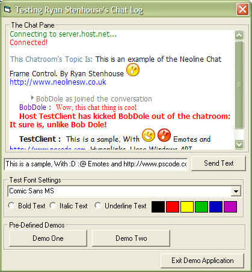



## Rich Text Formatted Chat  Pane, with Hyperlinks and Emoticons

### Description

This control duplicates most of the functionality of the "Chat Logs" people will encounter in Chat or Instant Messenger applications.

It wraps functions, for special formatting of text, and has a full range of pre-defined events which also can be displayed.

It detects link starting with http://, and using the windows API, will detect when the link is clicked, and open it in Internet Explorer (Based on a submission by another PSCode User, who's name I have forgotten)

Useing the Tag property of elements in an image list control, this chat log can detect when pre-defined key combinations are present in the text, and replace them with "emoticons". This is done using more Windows API Calls.

See the demo application, and the screenshot for a much better (and more visual) description. This Chat Log control is similar to the one used in a Chat Client I am currently developing, for Ionic Roleplay at http://www.ionicrp.co.uk.
 
### More Info
 
Obviously, this code using the Rich Textbox Control, so please ensure you have it before attempting to run.

In some cases, if an idle IE Window is open, instead of opening a new IE instance to follow a link, the control will take over the running browser.

             |
---                |---
**Submitted On**   |2004-07-19 00:00:10
**By**             |[Ryan Stenhouse](https://github.com/Planet-Source-Code/PSCIndex/blob/master/ByAuthor/ryan-stenhouse.md)
**Level**          |Intermediate
**User Rating**    |5.0 (45 globes from 9 users)
**Compatibility**  |VB 6\.0
**Category**       |[Custom Controls/ Forms/  Menus](https://github.com/Planet-Source-Code/PSCIndex/blob/master/ByCategory/custom-controls-forms-menus__1-4.md)
**World**          |[Visual Basic](https://github.com/Planet-Source-Code/PSCIndex/blob/master/ByWorld/visual-basic.md)
**Archive File**   |[Rich\_Text\_1774667262004\.zip](https://github.com/Planet-Source-Code/ryan-stenhouse-rich-text-formatted-chat-pane-with-hyperlinks-and-emoticons__1-55205/archive/master.zip)

